<p align="center">
  
</p>

# babble-on — TrueRNG Entropy Observatory

A Tauri 2 desktop app that reads from a TrueRNG hardware random-number generator (or falls back to a built-in software simulator) and visualises the stream quality in real time. Entropy harvested from the live stream — and, preferentially, from an anomaly bank of out-of-band bytes — seeds the initial latent for on-device diffusion text generation.

The app also **records** its raw stream and **exports** anomaly-bank seeds for the separate [experiment harness](harness/README.md), which drives Google's **DiffusionGemma** from that entropy and compares in-coherence vs. out-of-coherence generations mechanistically. See the [design spec](docs/superpowers/specs/2026-10-02-diffusiongemma-harness-design.md).

## Quick Start (observatory)

Requirements: **Rust** (stable, 2021 edition) and **Node.js** ≥ 18 with npm. No hardware needed — without a TrueRNG plugged in, the app uses its software simulator.

```bash
npm install
npm run tauri dev
```

A native window opens within a few seconds. On first launch the source defaults to **auto-detect**, which uses the first `/dev/cu.usbmodem*` (macOS) device found, or falls back to the simulator if none is plugged in. On Linux, auto-detect also matches `/dev/ttyACM*` devices.

## Text Generation Setup (optional)

Everything above works on a bare clone. The **Generate** button additionally needs the Plaid-1B model — a ~4.7 GB download, ~10 GB on disk once converted. Without it, generating shows `error: load model: …` in the status line.

Extra prerequisites: [`uv`](https://github.com/astral-sh/uv), Python 3.12, and the [GitHub CLI (`gh`)](https://cli.github.com).

1. **Download the weights** (published by [igul222/plaid](https://github.com/igul222/plaid)):

   ```bash
   # from the repo root
   mkdir -p models/plaid1b && cd models/plaid1b
   gh release download v1.0.0 --repo igul222/plaid --pattern 'plaid1b_weights*'
   cat plaid1b_weights.tar.gz.* | tar xzf - && mv plaid1b_weights/* . && rmdir plaid1b_weights
   cd ../..
   ```

2. **Set up the Python environment** (used for the one-time conversion):

   ```bash
   cd sidecar
   uv venv --python 3.12 .venv
   uv pip install --python .venv/bin/python -r requirements.txt
   ```

3. **Convert to the format the app loads** — the app generates with an all-Rust [candle](https://github.com/huggingface/candle) engine (`diffusion-rs/`), which reads a single safetensors file rather than the raw `.pt` checkpoints:

   ```bash
   .venv/bin/python convert.py   # still inside sidecar/
   ```

After this, `models/plaid1b/` contains the four `.pt` files plus `plaid1b.safetensors` and `meta.json` — the latter two are what **Generate** loads (on first use, so the first generation takes longer).

Generation runs Metal-accelerated on Apple Silicon with a CPU fallback, and is developed and tested on macOS (the Metal feature is enabled only on macOS, so the crates also build and test headless on Linux). The `sidecar/` Python service is the reference implementation the Rust port is validated against, and doubles as a standalone playground — see [`sidecar/README.md`](sidecar/README.md).

## Building a Shareable App

```bash
npm run tauri build
```

The bundle lands at `src-tauri/target/release/bundle/macos/babble-on.app` — zip it for sharing with `ditto -c -k --keepParent babble-on.app babble-on.zip`. Recipients install nothing (no Rust, Node, or Python): the observatory works out of the box, and the tokenizer ships inside the app. For **Generate**, they drop the converted model files (`plaid1b.safetensors` + `meta.json`, produced once via the [setup above](#text-generation-setup-optional) on any machine) into:

```
~/Library/Application Support/com.crashy.babble-on/models/plaid1b/
```

The app names this exact path in its error message if the model is missing.

Notes: the build is Apple Silicon and ad-hoc signed, so recipients must right-click → **Open** on first launch (or run `xattr -cr babble-on.app` after unzipping). The `.dmg` bundling step drives Finder via AppleScript and can fail in headless terminals — the `.app` bundle is unaffected.

## Source Switch

The drop-down in the top bar lets you choose the byte source at runtime:

| Option | Behaviour |
|--------|-----------|
| `auto` | Auto-detect TrueRNG; falls back to simulator |
| `simulate` | Software CSPRNG — metrics stay green |
| `bad` | Biased RNG — metrics turn red, coherence walk escapes |

The **pause** button freezes accumulation without discarding state; **reset** clears the sliding window and starts fresh.

## What Each Panel Shows

| Panel | Description |
|-------|-------------|
| **Coherence walk** | Cumulative signed sum of bits (±1 per bit). The gold envelope is the expected 2σ band; a healthy source wanders inside it. A biased source bolts out. The envelope funnel stays anchored on screen — the vertex is pinned at the left and the whole session compresses into it, so only the line moves. |
| **NIST metrics list** | Shannon entropy, min-entropy, NIST monobit, chi-square, and serial correlation — each with a PASS / FAIL verdict and colour. |
| **Byte histogram** | 256-bar frequency distribution. A flat histogram indicates uniform byte output. |
| **Bitstream ribbon** | Live 0/1 tile strip; green = 1, dark = 0. |

## Anomaly Bank

Bytes that arrive while the coherence walk is outside its 95% envelope are
harvested into a 64 KiB FIFO **anomaly bank** (gold meter in the anomaly-log
panel). Each generation's initial latent is seeded from the bank first —
destructively, so every anomaly's bytes seed exactly one text — topped up from
the live stream when the bank runs short. The stamp under the output records
the provenance, e.g. `seed: 72% anomaly bank — +3.2σ @ 14:32`.

Demo arc (needs the [text generation setup](#text-generation-setup-optional)):
switch the source to **bad rng** → the walk escapes the gold band → the bank
floods → hit **Generate** → the text is stamped with the anomaly that birthed
it. **reset** clears the bank along with the stats.

## Recording & Seed Export (for the harness)

- **● record** (header) writes every tick's raw bytes with a timestamp to
  `<app-data>/recordings/stream-<ts>.bbrec`; the button shows the running
  size and stops the recording on a second click. Paused ticks are not
  recorded. The harness replays the coherence walk over the file to label
  each byte in- or out-of-band (`python -m babble_harness.cli label`).
- **export seed** (diffusion pane) draws 97 KiB — one DiffusionGemma canvas
  at 48 steps — bank-first exactly as **Generate** would, and writes
  `<app-data>/exports/seed-<ts>.seed.bin` + `.seed.json` (bank fraction,
  anomaly tags). It spends the bank, so the meter drops.
- The anomaly bank now holds 512 KiB (~5 DiffusionGemma seeds).

Both formats are defined once in the dependency-light [`bbrec`](bbrec/) crate
and mirrored in Python; the bytes → uniform mapping is pinned by
`docs/contract/noise_vectors.json` on both sides.

## DiffusionGemma in the app

The engine drop-down in the diffusion pane selects **Plaid-1B · candle**
(in-process, 16 KiB latent seed) or **DiffusionGemma · sidecar**. The latter
spawns the harness's `serve` mode on first use and keeps it resident; every
random choice of DiffusionGemma's masked-diffusion sampler (initial canvas,
per-position token draw, renoising) comes from a `4·256·(1+2·steps)`-byte
entropy tape drawn bank-first exactly like the Plaid seed. Step events
stream the argmax canvas so the crystallisation view works unchanged, and
`done` reports early stopping.

Setup: create the harness venv (see [`harness/README.md`](harness/README.md),
including the `[model]` extra for the real weights). The app finds
`harness/.venv/bin/python` in a dev checkout; set `BABBLE_SIDECAR_MODEL`
(`diffusion_gemma` default, `tiny` or `stub` for weight-free development) or
`BABBLE_SIDECAR_CMD` (a full command line, for a bundled app or a remote
GPU box's interpreter). The model load for the 26B checkpoint takes minutes
on first generate; the status line says so.

## Visual 3-state smoke (user-run)

Because this README is authored by a headless CI agent, the following end-to-end check must be performed by a human on a machine with a display:

1. Run `npm run tauri dev` with source set to **simulate** → metrics should be green within ~2 s.  
2. Switch to **bad rng** → verdicts turn red and the coherence walk escapes the gold band.  
3. Switch to **auto** with a TrueRNG plugged in → the status label shows the `/dev/cu.usbmodem*` device path; without hardware it shows `simulate`.

## Anomaly bank smoke (user-run)

Also user-run, for the same reason as above:

1. `npm run tauri dev`, source **simulate** → bank meter present, near-empty (healthy source banks at ~5% duty cycle).
2. Switch to **bad rng** → walk escapes; bank meter visibly fills gold.
3. **Generate** → stamp shows a bank percentage and σ/time tags; bank meter drops by ~16 KiB (one 256-token latent).
4. Generate again with an empty bank → stamp reads `seed: live stream`.
5. **reset** → meter returns to zero.

## Verification Status (headless CI)

| Check | Result |
|-------|--------|
| `npm run build` (vite) | ✓ pass |
| `cargo build --release` | ✓ pass |
| `cargo test` (src-tauri) | ✓ 33/33 pass (Linux, CPU; includes a sidecar round trip against the harness stub) |
| `cargo test` (bbrec) | ✓ 11/11 pass |
| `harness/` pytest | ✓ 50/50 pass (adapter on a tiny DiffusionGemma, parity vs. Transformers `generate`) |
| `npm run test` (vitest) | ✓ 7/7 pass |
| Visual 3-state smoke | **user-run** (see above) |
| Anomaly bank smoke | **user-run** (see above) |

## Credits

The entropy/coherence mathematics and NIST metric implementations were ported from the [ghostty-rng](https://github.com/crashy/ghostty-rng) sibling project. Core modules: `math.rs`, `stats.rs`, `source.rs`.

The diffusion model is **Plaid-1B** ([igul222/plaid](https://github.com/igul222/plaid), *Likelihood-Based Diffusion Language Models*, Gulrajani & Hashimoto) — see [`sidecar/README.md`](sidecar/README.md) for attribution details.
