# Run report — `dry-run-tiny`

model `tiny` · 2026-10-03 21:31 · samples: in_band=48, out_band=48, prng=48, remote=48

sampler: canvas 16 · ≤ 8 steps · T 0.8→0.4 · entropy bound 0.1 · early stop on · budget 1088 bytes/sample

`harness/runs/device.bbrec` (simulated, not kept): 12,000,000 bytes, 2400 trials, final σ +3.50 (99.9%)

`harness/runs/remote.bbrec` (simulated, not kept): 6,000,000 bytes, 1200 trials, final σ +0.65 (in-band)

## Crystallisation









## Per-condition medians

| scalar | in_band | out_band | prng | remote |
|---|---|---|---|---|
| accepted_mean | 1 | 1 | 1 | 1 |
| accepted_step0 | 1 | 1 | 1 | 1 |
| commit_step_mean | 7 | nan | nan | 7 |
| commit_step_spread | 0 | nan | nan | 0 |
| distinct1 | 1 | 0.9688 | 0.9375 | 1 |
| distinct2 | 1 | 1 | 1 | 1 |
| entropy_auc | 44.05 | 44.05 | 44.05 | 44.05 |
| entropy_final | 5.478 | 5.478 | 5.478 | 5.478 |
| entropy_step0 | 5.524 | 5.524 | 5.524 | 5.524 |
| flips | 128 | 128 | 128 | 128 |
| logit_lens_depth | 0 | 0 | 0 | 0 |
| logit_lens_mean | 0.7422 | 0.7214 | 0.7344 | 0.7227 |
| n_steps | 8 | 8 | 8 | 8 |
| never_stable_frac | 1 | 1 | 1 | 1 |
| repeat_frac | 0 | 0 | 0 | 0 |
| router_entropy_mean | 1.342 | 1.341 | 1.342 | 1.343 |
| stopped_early | 0 | 0 | 0 | 0 |
| tape_consumed | 1088 | 1088 | 1088 | 1088 |

## in_band vs out_band (Mann–Whitney, two-sided)

| scalar | median in_band | median out_band | z | p |
|---|---|---|---|---|
| accepted_mean | 1 | 1 | +0.00 | 1 |
| accepted_step0 | 1 | 1 | +0.00 | 1 |
| commit_step_mean | nan | nan | +nan | nan |
| commit_step_spread | nan | nan | +nan | nan |
| distinct1 | 1 | 0.9688 | +1.00 | 0.319 |
| distinct2 | 1 | 1 | +0.00 | 1 |
| entropy_auc | 44.05 | 44.05 | -1.28 | 0.2 |
| entropy_final | 5.478 | 5.478 | +0.23 | 0.82 |
| entropy_step0 | 5.524 | 5.524 | -0.87 | 0.383 |
| flips | 128 | 128 | -0.50 | 0.616 |
| logit_lens_depth | 0 | 0 | +0.00 | 1 |
| logit_lens_mean | 0.7422 | 0.7214 | +3.41 | 0.000638 ** |
| n_steps | 8 | 8 | +0.00 | 1 |
| never_stable_frac | 1 | 1 | -1.00 | 0.317 |
| repeat_frac | 0 | 0 | -1.68 | 0.0934 |
| router_entropy_mean | 1.342 | 1.341 | +0.59 | 0.553 |
| stopped_early | 0 | 0 | +0.00 | 1 |
| tape_consumed | 1088 | 1088 | +0.00 | 1 |

## Linear probes (mass-mean, cross-validated, permutation null)

- **scalar features** (10 dims): accuracy **0.552** vs null 0.498 ± 0.064 (p = 0.259, n = 96)
- **first-step pooled activations** (64 dims): accuracy **0.583** vs null 0.491 ± 0.066 (p = 0.0945, n = 96, |mean diff| = 0.602)
- **last-step pooled activations** (64 dims): accuracy **0.583** vs null 0.491 ± 0.067 (p = 0.114, n = 96, |mean diff| = 0.605)



## Reading the numbers

- `accepted_step0`, `commit_step_mean`: how fast the canvas crystallises — the direct analogue of the Plaid heat map.
- `entropy_auc`, `n_steps`: how much uncertainty the model carried before early stopping.
- `router_entropy_mean`: how spread expert routing was; `logit_lens_depth`: how deep the final answer appeared.
- The probe answers: can anything linear in the residual stream tell the conditions apart? Compare against `prng` and `remote` before believing a hit.
- Multiple comparisons: with ~15 scalars, expect ~1 false positive at p < 0.05 by chance.
